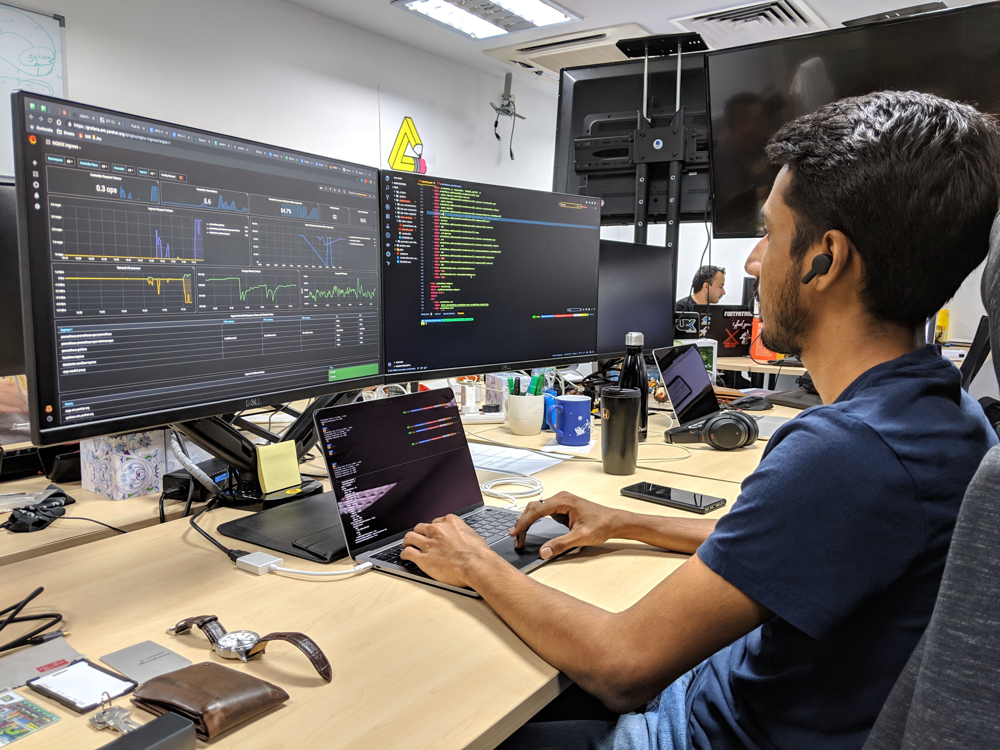

# Arvind Naidu

A repository that holds basic information about me that can be used for miscellaneous public facing endeavors.

## Biography 

My preferred biography for technical endeavors:

> Arvind Naidu is a Site Reliability Engineer (SRE) at [Learndot@ServiceRocket](https://www.learndot.com/) and a Cloud Consultant at [Mindvalley](https://mindvalley.com). Arvind also provides pro-bono consultations for [Fave](https://myfave.com/) and [Vase](https://vase.ai/). Arvind focuses primarily on reliability, resilience and performance of infrastructure and application by approaching / adopting good practises. Arvind currently lives in Kuala Lumpur and spends his free time skateboarding, reading and racing.

## Online Presence

 - [GitHub](https://github.com/naiduarvind) 
 - [Twitter](https://twitter.com/rvine_naidu) 
 - [LinkedIn](https://linkedin.com/naiduarvind) 
 

## Online Trails:

 - [About Me](https://naiduarvind.github.io)
 - [My Blog](https://medium.com/@arvindnaidu)

## Request for me to speak at your event

The best way to ask me to speak at your conference is to book a time [here](https://calendly.com/arvind-naidu/talk-by-arvind) and include the following information:

 - What is the name of the event?
 - What is the best link to find out more about the event?
 - What is your name and contact information?
 - What type of presentation you have in mind?
 - Are there any race tracks near the event? Skate park? Exotic cafes?
 - Anything else you want!
 
 These events go directly to a private account that I own. I receive push notifications, so I assure you - I will see this request. It might take me a while to get back to you, so please be patient. 
 
## Presentations and Blog Posts

#### Black Swans of EKS in Production (Day 118)

#### The Journey of Being an SRE

#### First Quarter as an SRE

  

#### Chaos Engineering

#### Simplifying Observability on Regressions

#### Making The Invisible Visible: Costs

